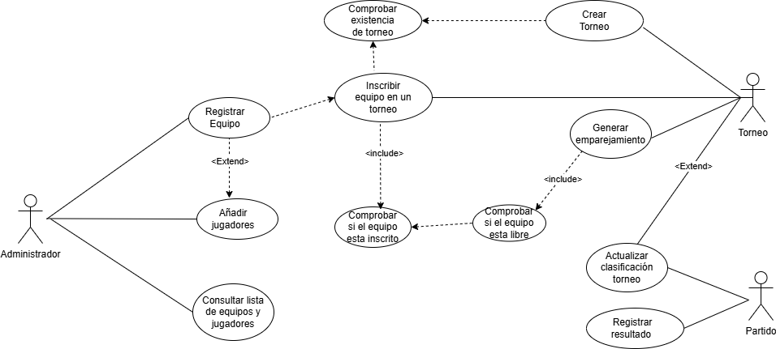
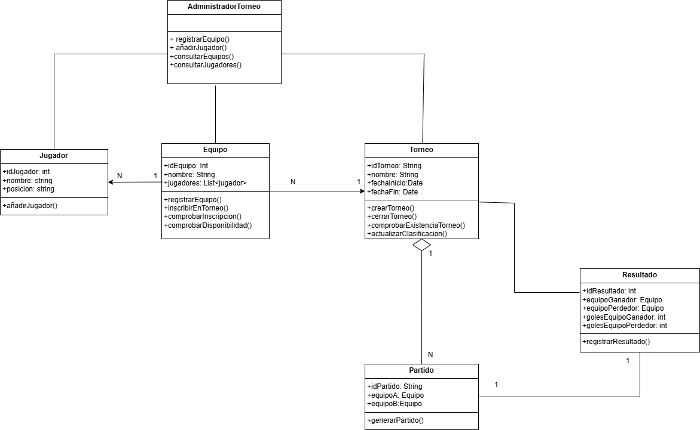

# Sistema de Gestión de Torneos de futbol

## Autor

Yeimmy Melissa Rodriguez Morales

## Descripción del Proyecto

Trabajo para la asignatura de entornos en el que he creado unos diagramas UML. En UML he creado un diagrama de clases y uno de usos.

En cuanto a los actores, encontré 4 actores, el administrador, Torneo, Equipo, jugador.

## Diagramas UML

### Diagrama de Casos de Uso

### Diagrama de Clases

## Instalación y Ejecución

1.Clonar el repositorio: git@github.com:meli2304/torneo-esports-uml.git

## Justificación del Diseño

El diagrama de casos de uso modela las funcionalidades clave de un sistema de gestión de torneos, diferenciando claramente dos actores principales: Administrador y Equipo. Esta separación permite asignar responsabilidades específicas: el Administrador gestiona la creación de torneos, emparejamientos y clasificación; mientras que los Equipos pueden registrarse, añadir jugadores e inscribirse en torneos.

Se emplean relaciones «include» para representar acciones obligatorias (como comprobar si el equipo ya está inscrito o si el torneo existe) y «extend» para indicar funcionalidades opcionales (como añadir jugadores al registrar un equipo). El diseño modular facilita la escalabilidad y claridad del sistema, apoyando tanto el desarrollo como la comprensión por parte de los usuarios.

## Conclusiones

Este proyecto me ha servido para entender mucho mejor UML y su representación con los diagramas de uso y de clases, aunque se me ha dificultado un poco, buscando en páginas e incluso viendo vídeos en youtube pude aclararme más.
